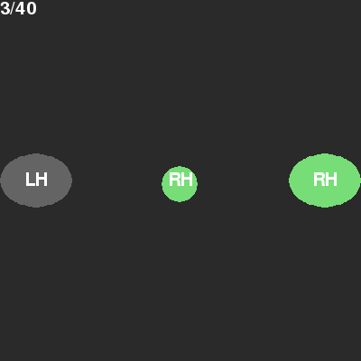

# Brainfly in Python




## Requirements
- Python 3.6
- PyGame
- NumPy
- SciPy
- matplotlib
- scikit-learn

## Usage
First, you should calibrate the BCI. This can be done by running the following commands at the same time:
```
$ python analyze/gather_train_data.py
$ python calibrate.py
```
After this step, the training data will be saved to a pickle file called `training_data.pk`.

Second, you can train the classifier by running. This will process the collected data and train a Logistic Regression model to distinguish the two classes.
```
$ python analyze/training.py
```

Third, you can train the participant with the continuous feedback phase. This uses the trained classifier and closely resembles the final game. You need to run the following commands at the same time:
```
$ python analyze/feedback.py
$ python continuous_feedback.py
```

Finally, you can play the full game. Once again run these two commands:
```
$ python analyze/feedback.py
$ python brainfly.py
```
