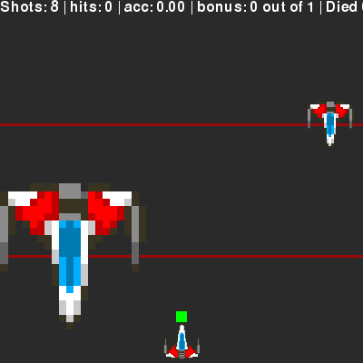

# Brainfly in Python




## Requirements
- Python 3.6
- PyGame
- NumPy
- SciPy
- matplotlib
- scikit-learn

## User's guide
First, you should calibrate the BCI. This can be done by running the following commands at the same time:
```
python analyze/gather_train_data.py
python calibrate.py
```
After this step, the training data will be saved to a pickle file called `training_data.pk`.

Second, you can train the classifier by running. This will process the collected data and train a Logistic Regression model to distinguish the two classes.
```
python analyze/training.py
# After training, you can visualize the signals by running
python analyze/plot_signals.py
```

Third, you can train the participant with the continuous feedback phase. This uses the trained classifier and closely resembles the final game. You need to run the following commands at the same time:
```
python analyze/feedback.py
python continuous_feedback.py
```

Finally, you can play the full game. Once again run these two commands:
```
python analyze/feedback.py
python brainfly.py
```

## Programmer's guide
This is an overview of the files and their purposes. More detailed comments can be found in the code.
### Stimuli and related files
- `brainfly.py`: Brainfly game. Constants are derived best as possible from the MATLAB version. Enemies appear left or right at random. Run with `--simulation` option to simulate the BCI. Parameters which can be tweaked can be found at the top of the file, (e.g., `ENEMY_ALIVE_TIME`, `GAME_TIME`, `PLAYER_SPEED`).
- `calibration.py`: Present the stimuli for the calibration phase.
- `continuous_feedback.py`: Continuous feedback phase. Closely resembles the real game, but a lot slower. The player gets reset whenever the next enemy appears.
- `controller.py`: Implementation of the movement-based-decoder.
- `util.py`: Utility functions for brainfly.

### Signal analysis
These files all live in the `analyze` folder
- `feedback.py`: Use the trained classifier to classify live data. Listens for experiment.predict events, then classifies these and sends the prediction as a classifier.prediction event.
- `gather_train_data.py`: Listens for stimulus.target events until it sees  the (stimulus.training, end) event. Then saves all data in a pickle.
- `plot_signals.py`: Plot the signals generated during the calibration phase. Uses the processed_data generated from `training.py`.
- `training.py`: Load data collected during the training phase, preprocess it and train a Logistic Regression classifier. The classifier is saved to a pickle file.
